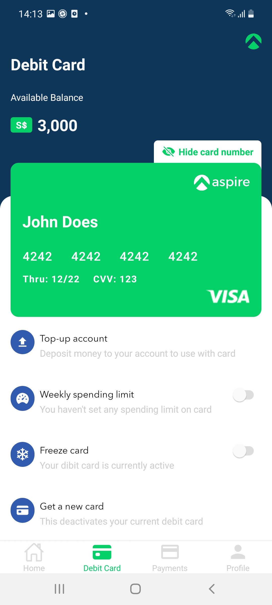
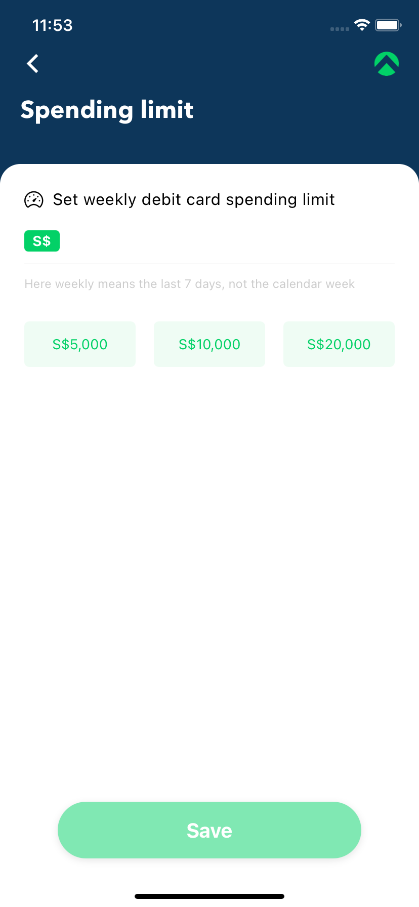
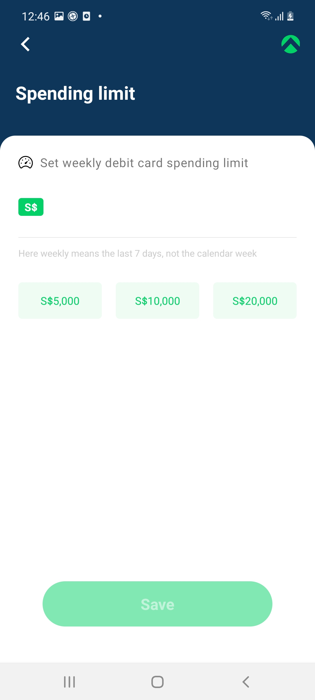
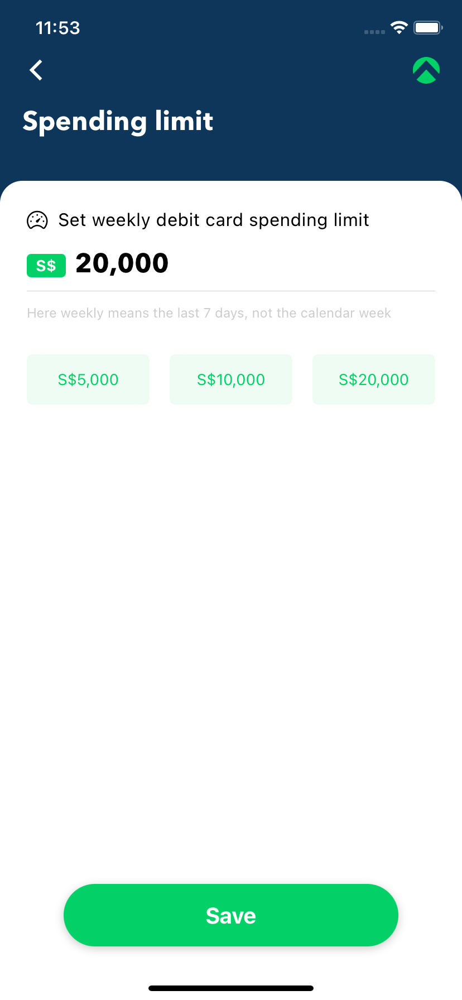
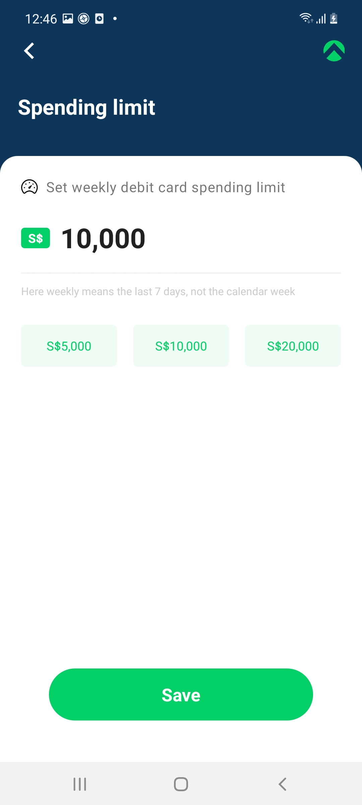
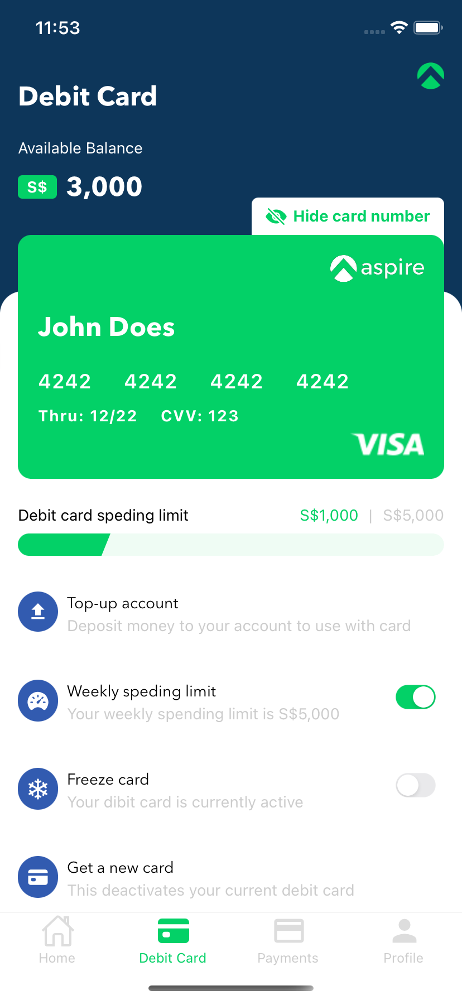
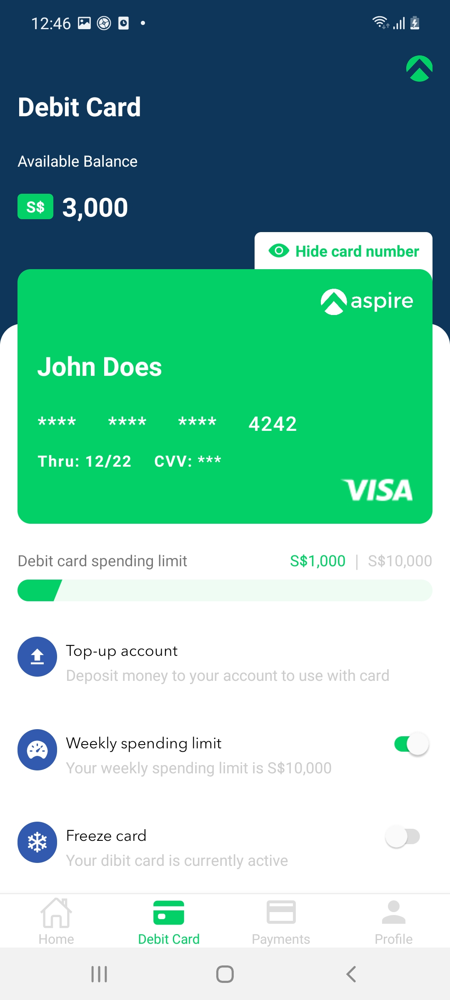
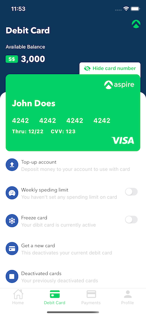

# Debit Card

## User Story

#### I. As a user when I opened the app and navigated to the Debit Card screen:

1. I can see card information and available balance.
2. I can tap on the hide button to hide the number and CVV of the Card.
3. I can see a menu list.
4. I can tap on the Weekly spending limit to set the limit of spending. If there is no limit the switch button will be disabled. Otherwise, this button will be enabled when there is a limit that has been set.
5. If the weekly spending limit doesn't set, I can tap on the button then navigate to the Spending Limit screen.

#### II. When I stayed Spending Limit Screen:

1. I can tap on the suggestion list under the input field.
2. I can manually type a number into the input field.
3. The button will be disabled if there is no number inputted. Otherwise, I can submit to set spending limit, after setting the spending limit successfully the screen will navigate back to Debit Card, then I can see spending and limit number under card box, and the switch button will be enabled.

## Requiement to development

- [Nodejs](https://nodejs.org/en/)
- [React native](https://reactnative.dev/)
- [React js](https://reactjs.org/)
- [Redux](https://redux.js.org/)
- [Redux Saga](https://redux-saga.js.org/)
- [React navigation](https://reactnavigation.org/)
- [Typescript](https://www.typescriptlang.org/)
- [Unit test jest](https://jestjs.io/docs/en/tutorial-react-native)

**First at all: clone project and install package with yarn**

Open your favorite Terminal and run these commands.

```sh
git clone https://github.com/phivh/debitcard.git debitcard
cd debitcard && yarn
```

#### The command to run development

```sh
yarn start

Run to android in another terminal.
Create local.properties file in android folder with this template, replace USER_NAME by computer username.

- sdk.dir=/Users/<USER_NAME>/Library/Android/sdk

Then run:
- yarn android

Run to ios in another terminal
- yarn ios

Run to ios with "iPhone 11" in another terminal
- yarn ip11
```

#### The command to run test

```sh
Run test all unit test
- yarn test
```

## Screenshots

| iOS                                                    | Android                                                    |
| ------------------------------------------------------ | ---------------------------------------------------------- |
|  |  |
|  |  |
|  |  |
|  |  |

## Video

[](https://youtu.be/k8BEcheU_Rc)

## Know issues

- Card spending limit validation

Thanks & cheers!
